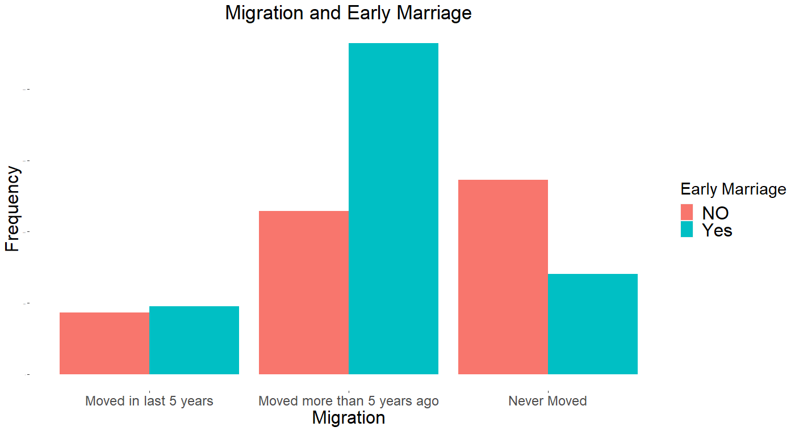
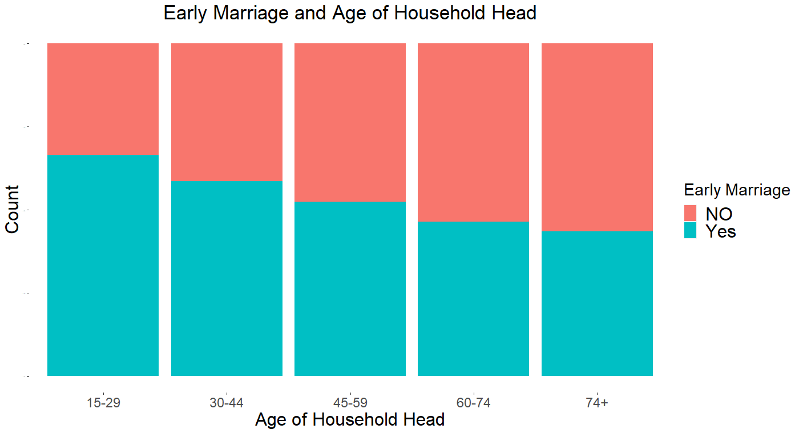

# Correlates of Minor Marriage in Bangladesh

## 📌 Overview
This project analyzes the determinants of early marriage among women in Bangladesh using the Multiple Indicator Cluster Survey (MICS) 2019 dataset. The goal was to identify key socio-economic and demographic factors influencing early marriage patterns.

## 📂 Dataset
- **Source:** UNICEF MICS 2019 (Bangladesh)
- **Size:** ~64,000 observations
- **Type:** National household survey data

## 🛠 Methodology
1. **Data Cleaning & Preprocessing** – Removing missing values, recoding variables, handling categorical data.
2. **Exploratory Data Analysis (EDA)** – Descriptive statistics & visualization (R, Power BI).
3. **Modeling** – Logistic Regression to estimate the effect of socio-economic variables.
4. **Visualization** – ggplot2 & Power BI dashboards for interactive insights.

## 📊 Key Insights
- Rural residence, lower education levels, and lower wealth index are significant predictors of early marriage.
- Urban women with higher education show substantially lower risk.
- Policy implication: Interventions should focus on rural education programs.

## 💻 Tech Stack
R | Power BI | ggplot2 | dplyr | Logistic Regression

## 📈 Visualizations
## Visualization

### Rate of Early Marriage All Over the Country

.png)
### Migration

### Age Distribution Household Head 

